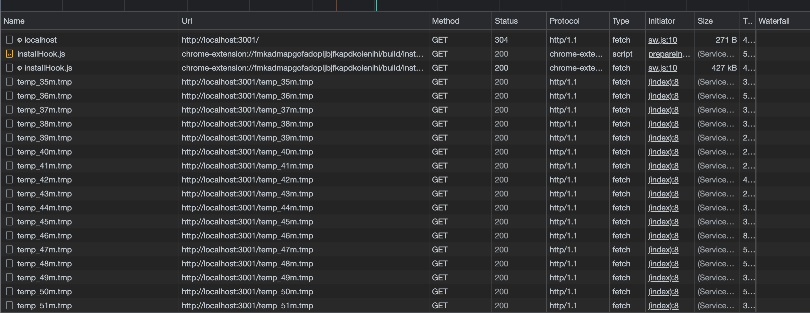

# POC: Browser cache limits

Browsers have a max size from which they begin to ignore the `Cache-Control` header and don't store that file in cache.

This Proof Of Concept creates and serve files with arbitrary sizes to test that limit

> Please Note: this test is intended to run on *MacOS*, may not work in a different OS.

## Running the PoC

Before to start you will need to have [NodeJS](https://nodejs.org/en/) installed on your machine.

Once you have NodeJS run the following command to create all dummy files

```bash
  npm run files:create
```

> Note 1: Edit `./mkfiles.sh` if you want to change the size of the files
>
> Note 2: Edit `index.html` to test which sizes will you test, don't load all because you can be reach the total max size of the cache at that point you browser will select which cache is keeping using a different algorithm that is outside the scope of this PoC
>
> Note 2: After you finish use the command `npm files:clear` to remove all dummy files to clear up to **5Gb** of disk

### Testing Browser Cache

Then start the HTTP server.

```bash
  npm start
```

Enter `http://localhost:3001`, open the browser inspector and go to the `Network` panel, make sure the `Disable cache` option is disabled

| Cache Disabled *(wrong)* | Cache Enabled *(ok)* |
| ------------------------ | -------------------- |
|  |  |

Reload the page to check which files were cached

### Testing Service Worker Cache

To enabled the Service Worker Cache just edit `./sw.js` and uncomment the [line 25](./sw.js#L25). Then reload the page twice, the first reload will cache all files in the service worker and the second will show which files are cached

## Conclusions

Even do in Firefox the `max_entry_size` is defined and can even be modified in `about:config`, 52Mb by default


Chrome and other browsers based on Chromium (Brave, Edge) doesn't specify that limit transparently, but according with this test is seems to be around the 42Mb.


> TODO: Safari doesn't seem to be caching anything!

You can use a `Service Worker` to cache bigger files:



But this has a drawback you need to consider, according with the [documentation](https://developer.mozilla.org/en-US/docs/Web/API/Cache):

> You are responsible for implementing how your script (e.g. in a ServiceWorker) handles Cache updates. Items in a Cache do not get updated unless explicitly requested; they don't expire unless deleted

And after you rich a Total Cache Size (1Gb) the browser will prompt the user asking o allow more space for the site, if is denied no new cache will be stored unless you removed by code or the user clears all site data.

This overhead of managing cache on the user ends may not make sense, in that case you will need to split your files in order to be have to cache them.
